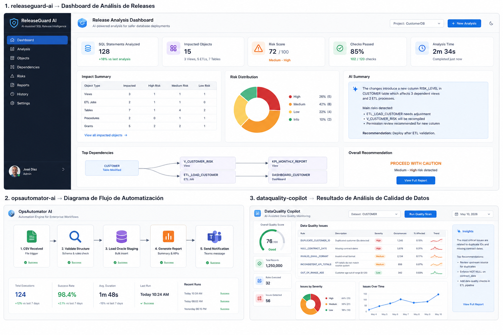
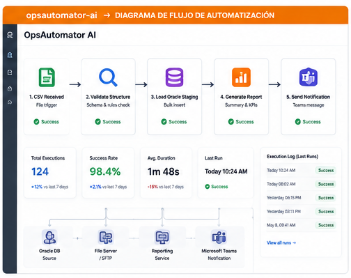
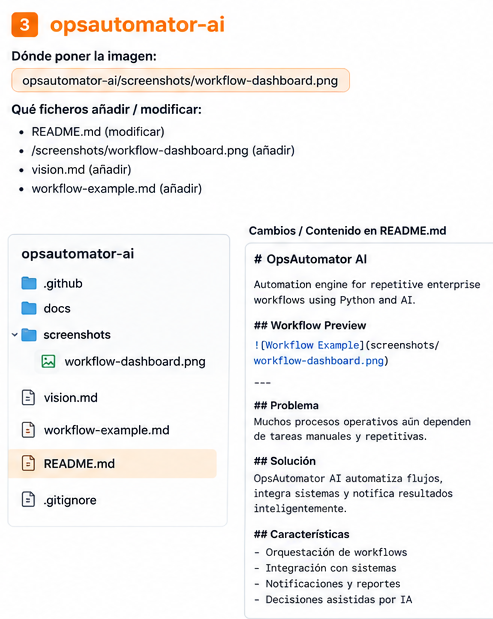

# OpsAutomator AI

Automation engine for repetitive enterprise workflows.

---

## Workflow Dashboard





---

## Workflow flowchart



---

## Problem

Many enterprise operational processes still depend on manual work:

- Excel validation
- weekly reporting
- CSV reconciliation
- operational checks
- repetitive documentation

## What OpsAutomator AI does

OpsAutomator AI automates repetitive workflows using Python and AI-assisted processing.

## Current concept features

- Excel validation
- CSV comparison
- Automated reporting
- AI summaries
- Operational alerts
- Report generation

## Example use case

Input:

```text
Weekly Excel sales report
```

Automation:

```text
- validate columns
- detect missing values
- compare against previous week
- generate executive summary
```

Output:

```text
Automated report:
- anomalies detected
- missing data
- key changes
- recommended actions
```

## Architecture

```text
Excel / CSV / Logs / SQL
          ↓
Automation Engine
          ↓
Validation Layer
          ↓
AI Processing
          ↓
Reports / Alerts
```

---

## Documentation

See:
- workflow-example.md
- vision.md

---

## Roadmap

- Excel validator
- Report generator
- Email integration
- Scheduling
- Dashboard# opsautomator-ai
Automation engine for repetitive enterprise workflows using Python and AI.
